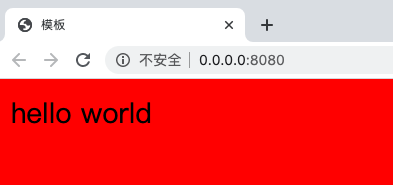

# 手把手教你创建一个 webpack的骨架

目录：
  1. [一个简单的页面](#1.一个简单页面)
  
TODO
* 初始化项目
* 创建 webpack 测试模式与开发模式
* 添加 babel
* 添加 eslint
* 添加 prettier
* 添加 postcss
* 添加 stylelint

备忘:

https://github.com/GoogleChromeLabs/webpack-libs-optimizations
https://github.com/GoogleChromeLabs/webpack-training-project

## 1.一个简单页面
这个只是一个普通的页面，使用script标签引入js文件。

目标：在`id=app`的div中显示当前的文章。

**Example:** [first-example](./examples/01-fisrt-example)

index.html
```html
<!DOCTYPE html>
<html lang="en">
<head>
  <meta charset="UTF-8">
  <title>helloworld</title>
</head>
<body>
<div id="app"></div>
<script src="./moment.js"></script>
<script src="./index.js"></script>
</body>
</html>
```

index.js
```javascript
function foo () {
  document.getElementById('app').innerHTML = moment().format('dddd')
}

foo()

```
打开index.html页面



