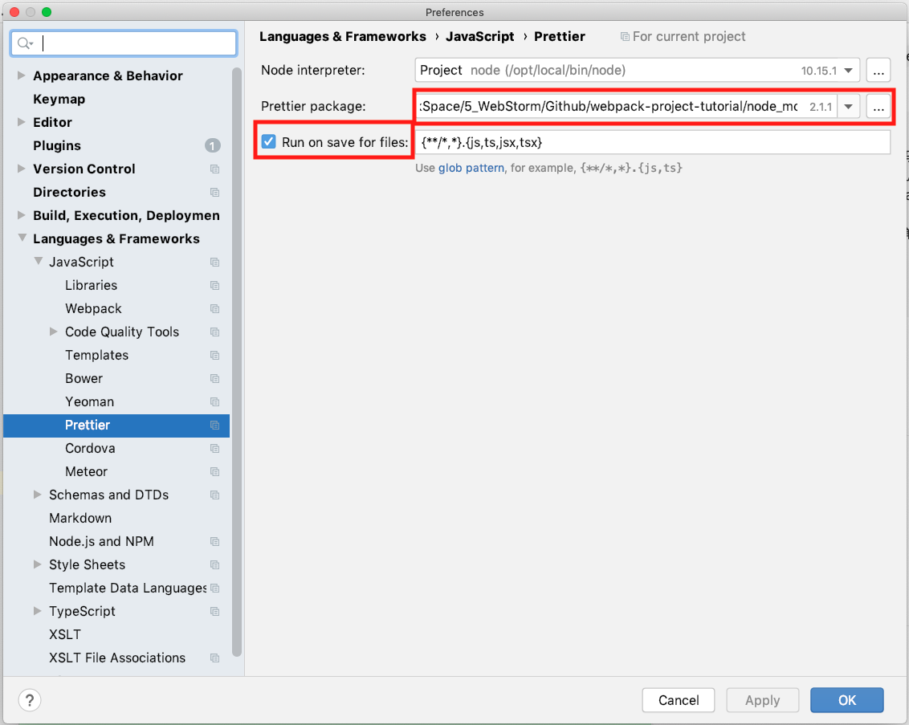

# 手把手教你创建一个 webpack的骨架
[01]: https://webpack.js.org/guides/
[02]: https://www.webpackjs.com/guides/
[11]: http://momentjs.cn/
[21]: https://docs.npmjs.com/creating-a-package-json-file 
## 前言
我发现有很多前端同学在**快速**实现产品经理**验证性**需求的时候，往往会采用简单的页面来实现。

简单的html页面确实可以快速搭建出一个demo出来。但是随着迭代的推进，越来越多的功能堆砌在了这个页面上面，最后难以扩展、难以维护。

> 开发人员一定要有远见！无论什么项目都应使用一个易扩展、易维护的架构。
>
> 以免给自己挖坑，到头来还得重构。

因此，希望前端同学能够通过这个文档学会：

- 创建 webpack 项目
- 开发模式与生成模式
- 添加 babel
- 添加 eslint
- 添加 prettier
- 添加 postcss
- 添加 stylelint
- 备选 sass

> **架构未必最优！如有好的建议，欢迎指出~**

## 目录：
  1. [一个简单的页面](#t01)
  2. [使用webpack构建项目](#t02)
  
前面几个例子是根据 [webpack官方文档][01]编写的。

大家也可以自己阅读 [官方文档][01] 进行自学，当然也可以看 [中文文档][02] 

> **注意**：中文文档更新不够及时。如果中文文档中的示例不好使，可以查看[官方文档][01]。

  
## 推荐网站：
十分钟学会markdown语法： <https://commonmark.org/help/>
  
备忘:

https://github.com/GoogleChromeLabs/webpack-libs-optimizations

https://github.com/GoogleChromeLabs/webpack-training-project

## <a id="t01">1.一个简单页面</a>
说明：这个只是一个平淡无奇的页面，使用script标签引入js文件。

目标：在`id=app`的div中显示当前的日期。

例子：[examples/01-fisrt-example](./examples/01-fisrt-example)

index.html
```html
<!DOCTYPE html>
<html lang="en">
<head>
  <meta charset="UTF-8">
  <title>first example</title>
</head>
<body>
<div id="app"></div>
<!--使用moment.js库来处理日期问题-->
<script src="./moment.js"></script>
<!--使用script标签引入js-->
<script src="./index.js"></script>
</body>
</html>

```

index.js
```javascript
function foo () {
  document.getElementById('app').innerText = moment().format('dddd')
}

foo()

```
打开index.html页面


## <a id="t02">2. 使用webpack构建项目</a>
说明：根据 [中文文档][02] 中的介绍，我们可以使用webpack构建第一个项目。


目标：
  - 使用 webpack 命令打包 JS

步骤：
  - 调整文件夹结构
  - 初始化项目
  - 安装 webpack
  - 安装 [moment.js][11] 库
  - 通过 import方式引入 [moment.js][11] 库
  - 调整 index.html
  - 运行 npx webpack
  
例子：[examples/02-first-webpack](./examples/02-first-webpack)

#### a. 调整文件夹结构



#### b. 创建 [package.json][21] 文件
在项目根目录下，使用 `npm init -y` 快速创建 [package.json][21] 文件，也可以使用 `npm init` 命令，分步创建 [package.json][21] 文件。

```
> npm init -y
Wrote to /github/create-webpack-project-step-by-step/examples/02-first-webpack/package.json:

{
  "name": "02-first-webpack",
  "version": "1.0.0",
  "description": "",
  "main": "index.js",
  "scripts": {
    "test": "echo \"Error: no test specified\" && exit 1"
  },
  "keywords": [],
  "author": "",
  "license": "ISC"
}

```
#### c. 安装 webpack 依赖以及 moment.js
通过运行yarn命令来安装 webpack 和 moment.js的依赖。
```bash
yarn add webpack webpack-cli moment
```

package.json
```json
{
  "name": "02-first-webpack",
  "version": "1.0.0",
  "description": "",
  "main": "index.js",
  "scripts": {
    "test": "echo \"Error: no test specified\" && exit 1"
  },
  "keywords": [],
  "author": "",
  "license": "ISC",
  "dependencies": {
    "moment": "^2.26.0",
    "webpack": "^4.43.0",
    "webpack-cli": "^3.3.11"
  }
}

```

